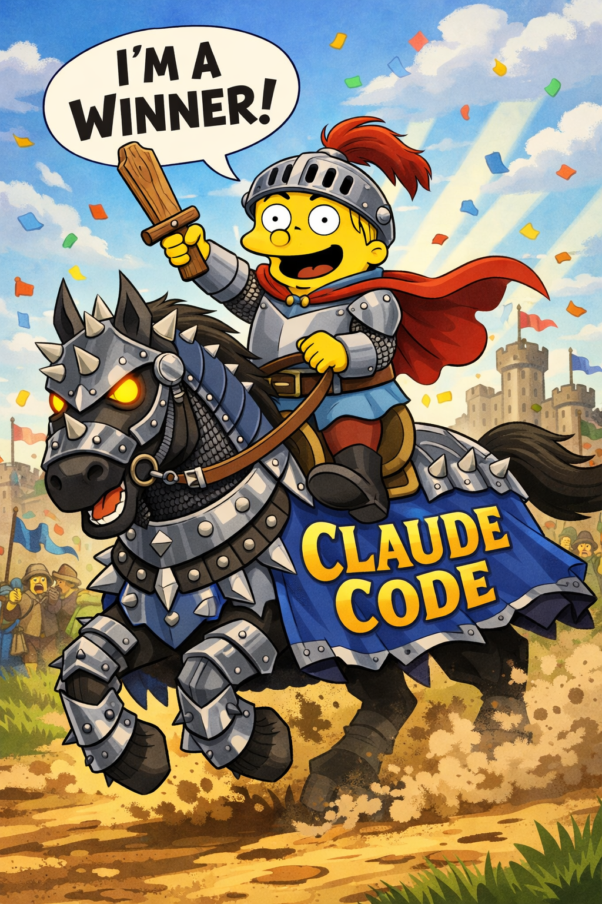

<div align="center">

# Ralph Wiggum

**An autonomous AI agent loop for Claude Code that runs until all PRD items are complete.**

**Each iteration is a fresh instance with clean context. Memory persists via git history.**

[](LICENSE)
[](https://docs.anthropic.com/en/docs/claude-code)



Based on [Geoffrey Huntley's Ralph pattern](https://ghuntley.com/ralph/).

> **Fork:** This project is a fork of [snarktank/ralph](https://github.com/snarktank/ralph).

</div>

---

## Security Warning

**Ralph runs AI agents autonomously with full access to your codebase.** Before running:

- **Never expose production credentials** - Ralph could accidentally commit, log, or transmit sensitive values like `AWS_ACCESS_KEY_ID`, `DATABASE_URL`, or API keys
- **Use sandboxing** - Run Ralph in a Docker container, VM, or isolated sandbox environment to limit potential damage
- **Review commits before pushing** - Always review what Ralph committed before pushing to remote

See [docs/SECURITY.md](docs/SECURITY.md) for complete security guidance, including pre-flight checklists and emergency stop procedures.

---

## Why This Exists

AI coding assistants lose context on large tasks. By the time they reach the end, they have forgotten the beginning.

Ralph solves this by:
- **Starting fresh each iteration** - Every task begins with full context capacity
- **Persisting memory in git** - Commits, `progress.txt`, and `prd.json` carry knowledge forward
- **Keeping tasks small** - Each story fits comfortably in one context window

The result: autonomous task completion that does not degrade over time.

---

## Who This Is For

- **Solo developers** who want to ship while they sleep
- **Small teams** who want to multiply their output
- **Anyone** who has a clear PRD and wants autonomous execution

Ralph works best when you have:
- Well-defined, testable acceptance criteria
- A codebase with type checking and tests
- Tasks that can be broken into small, independent stories

---

## How It Works

```
┌─────────────────────────────────────────────────────────────┐
│                      ralph.sh loop                          │
├─────────────────────────────────────────────────────────────┤
│                                                             │
│   1. Spawn fresh Claude Code instance                       │
│                          ↓                                  │
│   2. Read prd.json → pick next story (passes: false)        │
│                          ↓                                  │
│   3. Read progress.txt → learn from previous iterations     │
│                          ↓                                  │
│   4. Implement the story                                    │
│                          ↓                                  │
│   5. Run quality checks (typecheck, lint, test)             │
│                          ↓                                  │
│   6. If passing: commit, mark story passes: true            │
│                          ↓                                  │
│   7. Append learnings to progress.txt                       │
│                          ↓                                  │
│   8. All stories done? → EXIT                               │
│      More stories? → LOOP (back to step 1)                  │
│                                                             │
└─────────────────────────────────────────────────────────────┘
```

---

## Getting Started

**New to Ralph?** Check out the [Quick Start Guide](docs/quick-start.md) to get running in under 5 minutes.

### Prerequisites

- [Claude Code](https://docs.anthropic.com/en/docs/claude-code) installed and authenticated (`npm install -g @anthropic-ai/claude-code`)
- `jq` installed (`brew install jq` on macOS)
- A git repository for your project

### Installation

**Step 1: Copy Ralph to your project (required)**

```bash
# From your project root
mkdir -p scripts/ralph
cp /path/to/ralph-wiggum/ralph.sh scripts/ralph/
cp /path/to/ralph-wiggum/CLAUDE.md scripts/ralph/CLAUDE.md
chmod +x scripts/ralph/ralph.sh
```

**Step 2: Install skills (choose one)**

*Option A: Install skills globally*

```bash
cp -r /path/to/ralph-wiggum/skills/prd ~/.claude/skills/
cp -r /path/to/ralph-wiggum/skills/ralph ~/.claude/skills/
```

*Option B: Install skills locally to project*

```bash
# From your project root
mkdir -p .claude/skills
cp -r /path/to/ralph-wiggum/skills/prd .claude/skills/
cp -r /path/to/ralph-wiggum/skills/ralph .claude/skills/
```

---

## Workflow

### 1. Create a PRD

Use the PRD skill to generate a detailed requirements document:

```
Load the prd skill and create a PRD for [your feature description]
```

Answer the clarifying questions. The skill saves output to `tasks/prd-[feature-name].md`.

### 2. Convert PRD to Ralph format

Use the Ralph skill to convert the markdown PRD to JSON:

```
Load the ralph skill and convert tasks/prd-[feature-name].md to prd.json
```

This creates `prd.json` with user stories structured for autonomous execution.

### 3. Run Ralph

```bash
./scripts/ralph/ralph.sh [max_iterations]
```

Default is 10 iterations.

---

## Commands

### Bash Script (ralph.sh)

| Command | Description |
|---------|-------------|
| `./ralph.sh` | Run Ralph with default 10 iterations |
| `./ralph.sh 25` | Run Ralph with 25 max iterations |
| `./ralph.sh --skip-security-check` | Skip the security pre-flight check |
| `cat prd.json \| jq '.userStories[] \| {id, title, passes}'` | Check story status |
| `cat progress.txt` | View learnings from previous iterations |

### Python CLI (v_ralph.py)

V-Ralph is a Python CLI for managing and executing Ralph user stories. It provides colored terminal output, progress tracking, and enhanced debugging capabilities.

**Basic usage:**

```bash
cd scripts/ralph
python3 v_ralph.py status                 # Show PRD status with progress bar
python3 v_ralph.py run                    # Run next pending story
python3 v_ralph.py health                 # Check progress.txt health
```

**Run command flags:**

| Flag | Description |
|------|-------------|
| `--story STORY` | Run specific story by ID |
| `--dry-run` | Validate configuration without executing |
| `--max-retries N` | Maximum retry attempts per story (default: 3) |
| `-v, --verbose` | Show truncated prompts and full validation output |
| `--debug` | Show full prompts, file paths, environment info (includes verbose) |
| `-i, --interactive` | Interactively select which story to run |
| `--reset-attempts` | Clear attempt counter for specified story (requires --story) |
| `--skip-validation` | Skip validation phase for specified story (requires --story) |
| `--timings` | Show only timing information |
| `--force` | Proceed even if git safety checks detect unsafe state |
| `--validation-timeout SECONDS` | Validation timeout (default: 120, or from prd.json) |
| `--coder-timeout SECONDS` | Coder invocation timeout (default: 300, or from prd.json) |
| `--audit-timeout SECONDS` | Audit timeout (default: 180, or from prd.json) |

**Status command flags:**

| Flag | Description |
|------|-------------|
| `--estimate` | Show token estimates per story |

**Global flags:**

| Flag | Description |
|------|-------------|
| `--prd PATH` | Path to PRD file (default: prd.json) |

**PRD format support:**

V-Ralph supports both JSON (`.json`) and YAML (`.yml`, `.yaml`) PRD files. Timeouts can be configured in prd.json:

```json
{
  "timeouts": {
    "validation": 120,
    "coder": 300,
    "audit": 180
  }
}
```

---

## Key Files

| File | Purpose |
|------|---------|
| `ralph.sh` | The bash loop that spawns fresh Claude Code instances |
| `CLAUDE.md` | Instructions given to each Claude Code instance |
| `prd.json` | User stories with `passes` status (the task list) |
| `prd.json.example` | Example PRD format for reference |
| `progress.txt` | Append-only learnings for future iterations |
| `skills/prd/` | Skill for generating PRDs |
| `skills/ralph/` | Skill for converting PRDs to JSON |

---

## Critical Concepts

### Each Iteration = Fresh Context

Each iteration spawns a **new Claude Code instance** with clean context. The only memory between iterations is:
- Git history (commits from previous iterations)
- `progress.txt` (learnings and context)
- `prd.json` (which stories are done)

### Small Tasks

Each PRD item should be small enough to complete in one context window. If a task is too big, the LLM runs out of context before finishing and produces poor code.

**Right-sized stories:**
- Add a database column and migration
- Add a UI component to an existing page
- Update a server action with new logic
- Add a filter dropdown to a list

**Too big (split these):**
- "Build the entire dashboard"
- "Add authentication"
- "Refactor the API"

### CLAUDE.md Updates Are Critical

After each iteration, Ralph updates the relevant `CLAUDE.md` files with learnings. This is key because Claude Code automatically reads these files, so future iterations (and future human developers) benefit from discovered patterns, gotchas, and conventions.

### Feedback Loops

Ralph only works if there are feedback loops:
- Typecheck catches type errors
- Tests verify behavior
- CI must stay green (broken code compounds across iterations)

### Stop Condition

When all stories have `passes: true`, Ralph outputs `<promise>COMPLETE</promise>` and the loop exits.

---

## Troubleshooting

| Problem | Solution |
|---------|----------|
| Story keeps failing after multiple iterations | Check if acceptance criteria are clear and verifiable. Split into smaller stories if needed. |
| Ralph commits broken code | Ensure quality gates (typecheck, lint, test) are configured in your project. |
| Context runs out mid-story | Story is too big. Split it into smaller, focused changes. |
| Progress not persisting | Check that `progress.txt` exists and is being committed. |
| Wrong branch | Verify `branchName` in `prd.json` matches your intended branch. |

---

## Archiving

Ralph automatically archives previous runs when you start a new feature (different `branchName`). Archives are saved to `archive/YYYY-MM-DD-feature-name/`.

---

## Acknowledgments

This project is a fork of [snarktank/ralph](https://github.com/snarktank/ralph), originally created by the snarktank team. We are grateful for their foundational work on the Ralph agent pattern.

The original project is licensed under the MIT License, and this derivative work maintains that license with the original copyright notice preserved.

---

## References

- [Original Ralph repository (snarktank/ralph)](https://github.com/snarktank/ralph)
- [Geoffrey Huntley's Ralph article](https://ghuntley.com/ralph/)
- [Claude Code documentation](https://docs.anthropic.com/en/docs/claude-code)
